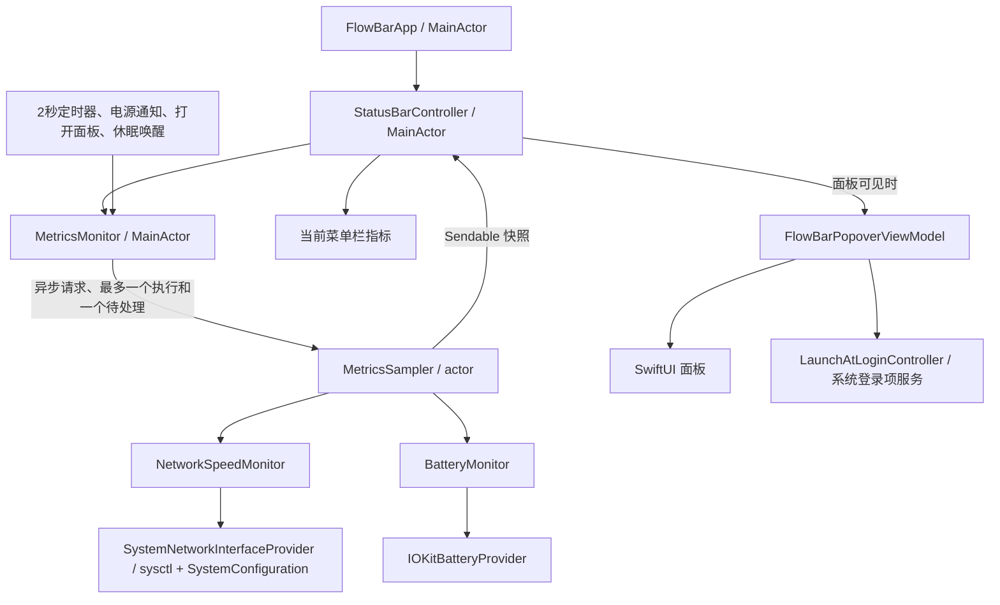

# FlowBar 架构与优化记录

审查日期：2026-10-05。范围：稳定性、资源占用、架构和验证，保留现有六项指标、面板布局、2 秒采样周期及 macOS 13 最低版本。

## 结论

项目是一个小型原生菜单栏工具，原有 Network / Battery / Metrics / App 分层合理，没有第三方运行时依赖，也没有历史存储或网络上传。本轮保留单个 Swift Package，重点补上采样调度、线程隔离和系统数据边界；无需引入数据库、事件总线或额外框架。

原来的主要问题不是算法复杂度，而是主线程同时负责系统读取、计时、状态合并、窗口管理和渲染，以及部分异常状态缺少测试。

## 当前数据流



| 模块 | 职责与约束 |
| --- | --- |
| `MetricsMonitor` | 管理定时器和请求合并；完整采样优先于电池刷新，重置采样优先级最高；停止后丢弃旧结果。 |
| `MetricsSampler` | actor 独占网络基线和最新快照；系统调用离开主线程；电池刷新保留最新网络值。 |
| `NetworkSpeedMonitor` | 以单调时钟计算相邻计数差；接口新增、消失、计数回退或数据缺失时重新建立基线。 |
| `IOKitBatteryProvider` | 获取原始系统字段，筛选存在的内部电池，并按需补充 pack 数据；不复制或重命名字段别名。 |
| `BatteryMonitor` | 集中解释原始字段、别名优先级、容量、温度、功率和供电状态；无效字段局部降级，明确无电池时整体不可用。 |
| `StatusBarController` | 管理菜单栏、窗口、生命周期通知；只向可见面板推送数据；窗口每次打开时定位。 |
| `FlowBarPopoverViewModel` | 产生可比较的展示行；显示内容变化才发布；登录项在打开面板、重新激活和用户操作后刷新。 |
| `LaunchAtLoginController` | 封装系统服务，返回真实状态和错误；注入替身测试，无需改变开发机器的登录项。 |

## 已处理的问题

| 优先级 | 原问题与影响 | 修复 |
| --- | --- | --- |
| P2 | 异常的有限大数转为 Int 会触发运行时错误。 | 格式化和电池数值解析采用受检转换；拒绝 NaN、Infinity 和越界数据。 |
| P2 | Date 作为网速分母，系统校时会造成虚低读数或不可用；跨休眠窗口也不代表当前速度。 | 使用 uptime；休眠停止采样，唤醒清除基线；首次显示 --，下一采样恢复速率。 |
| P2 | 当前容量直接当成百分比，驱动返回 mAh 时可能错误显示 100%。 | 有最大容量时按当前值 / 最大值换算；保留缺少最大容量时的有效百分比输入。 |
| P2 | 电池不存在但字段为零时仍显示 0W / 0% / 使用电池。 | 尊重 BatteryInstalled 和 Is Present 标记。 |
| P2 | 所有系统读取都在 UI 线程，没有慢读取和通知突发的调度边界。 | actor 串行读取；合并待处理请求，避免积压；主线程仅调度和显示。 |
| P2 | 登录项待批准、操作失败时只回弹开关或写日志。 | 根据真实状态提示批准需求或错误，提供系统设置入口；待批准时避免重复注册。 |
| P3 | 面板隐藏时仍每次构造和发布全部 rows，并查询登录项。 | 隐藏时不更新面板；展示行去重；移除采样路径中的登录项轮询。 |
| P3 | 顶层已有温度仍读取 AppleSmartBatteryPack；面板每次采样都重新定位。 | 仅在缺少温度时查询 pack；打开时定位，显示刷新保持窗口位置。 |
| P3 | 构建脚本的 debug 模式也关闭调试信息；缺少自动构建验证。 | debug 保留符号；校验配置参数和签名；新增 CI 测试、并发检查与 Release 打包。 |

容量转换依据 [Apple 容量字段说明](https://developer.apple.com/documentation/iokit/kiopscurrentcapacitykey) 和 [IOPMPowerSource 实现](https://github.com/apple-oss-distributions/xnu/blob/main/iokit/Kernel/IOPMPowerSource.cpp)。电池缺失语义参考 [AppleSmartBattery 实现](https://github.com/apple-oss-distributions/PowerManagement/blob/main/AppleSmartBatteryManager/AppleSmartBattery.cpp)。CI 使用 [GitHub 官方 Swift 工作流说明](https://docs.github.com/en/actions/tutorials/build-and-test-code/swift) 中的 macOS runner 和 Swift 构建方式。

## 代码与文件精简

- 四种卡片共用文件内的背景与描边修饰器，退出按钮保留独立的红色悬浮效果；悬浮状态使用局部 `@State`，不再为单个布尔值创建 `ObservableObject`。
- 展示行只保存指标和值，图标、标题和颜色由视图读取指标定义；ViewModel 不再依赖 SwiftUI。登录项开关直接读取服务状态，去掉中间转发属性。
- 电池 Provider 返回原始字典，字段别名及供电状态转换集中到 Monitor。保留旧生产路径中“存在的别名覆盖主键”的规则，即使别名值无效也不会静默改用被遮盖的主键；通过混合键测试固定此规则。
- 脚手架测试并入采样测试，格式化断言归入指标测试，删除单独的 `FlowBarScaffoldTests.swift`。
- [旧 HTML 交互原型](archive/flowbar-prototype.html) 仅作为历史设计资料归档，不参与构建，文案和模拟数据不代表当前应用。图标 PNG 源素材和生成的构建目录保留。

本次精简使生产 Swift 文件从 1,525 行降至 1,475 行；测试文件从 11 个合并为 10 个，并增加混合字段优先级的覆盖。原型归档前后的文件内容哈希一致。

## 性能判断

审查时对真实网络 provider 连续读取 100 次，耗时中位数约 1.82 ms，95 分位约 2.10 ms，最大约 3.77 ms。这只是当前机器上的局部测量，不代表其他机型，也不证明旧版本存在可见卡顿。

本轮降低可确认的重复工作，并把系统读取移出主线程。尚未进行长时间 Energy Log 或前后 CPU 对照，因此不声称具体的 CPU、内存或续航提升比例。暂不缓存硬件接口清单，以免引入接口热插拔失效处理；仍按 2 秒读取电池以保持原有刷新行为。

## 验证与后续边界

本次最终本地验证：76 项测试通过（最初架构审查前为 35 项）；严格并发构建无编译警告或错误；Release 应用包构建和签名验证通过，二进制最低系统版本仍为 13.0。验证工具链为本机 Apple Swift 6.4；GitHub CI 配置已添加，但尚未推送触发远端运行。

自动测试覆盖网络恢复、容量单位、异常数字、缺失电池、解析器畸形数据、显示去重、登录项批准/失败，以及采样请求合并、停止、重启和释放。采样测试还直接验证从主线程发起请求时，底层读取发生在其他线程。

常用验证命令：

```bash
swift test
swift build -Xswiftc -strict-concurrency=complete -Xswiftc -warnings-as-errors
bash build.sh
codesign --verify --strict .build/FlowBar.app
```

CI 以只读仓库权限运行相同检查。现有“检查构建脚本文字是否包含 codesign”的测试已替换为实际打包和签名验证。

仍需在真实设备上验证：休眠唤醒、AC 插拔、双屏/全屏下的面板位置、登录项批准 UI，以及 macOS 13 / Intel 机器。自动化 UI 工具在本次读取构建应用时超时，因此不将真实界面交互列为已通过。测试中的登录项服务为替身，不会注册或注销用户的真实登录项。

温度与电流仍依赖机型相关的 IOKit 字段，保留已有的温度单位兼容规则；传感器缓存延迟无法通过更频繁轮询解决。发布包仍使用本地 ad-hoc 签名；Developer ID、公证和正式发布应单独安排。本轮未提升最低系统版本、改变 bundle ID 或发布版本。
